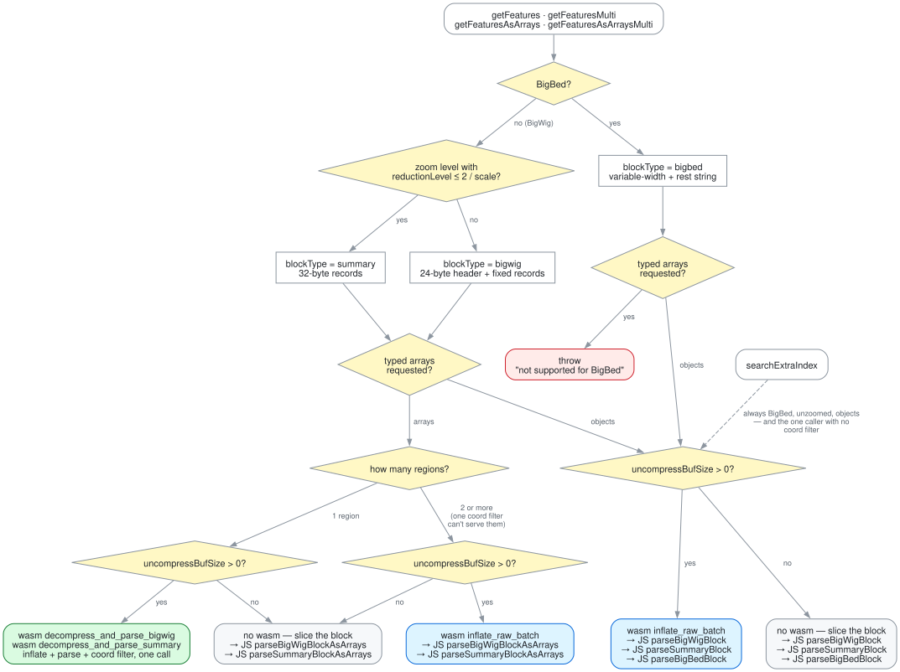

# Which parser runs

Four parsers read the same records — JS objects, JS typed arrays, and the fused
wasm pair — and which one runs depends on things a caller never sees: whether
the file is compressed, whether it asked for objects or arrays, whether it named
one region or several. Nothing about this is in the API, so this document is for
contributors, and for anyone reading a stack trace that names a function they
never called.

- [The chart](#the-chart)
- [The four questions](#the-four-questions)
- [The leaves](#the-leaves)
- [Why they have to agree](#why-they-have-to-agree)
- [Regenerating the chart](#regenerating-the-chart)

## The chart



Source: [`parser-selection.dot`](img/parser-selection.dot). Green parses in
wasm, blue inflates in wasm and parses in JS, grey touches no wasm at all. The
dashed edge is `searchExtraIndex`, which joins below the reader question because
it is never a typed-array read.

## The four questions

### 1. BigBed or BigWig, and at what zoom — `getView`

`BBI._getView` resolves a `scale`/`basesPerSpan` option into a `BlockView` over
one on-disk index, and the index it picks fixes the record layout for everything
downstream:

| `blockType` | Layout                                 | Chosen when                                           |
| ----------- | -------------------------------------- | ----------------------------------------------------- |
| `bigbed`    | variable-width, trailing `rest` string | any BigBed read                                       |
| `summary`   | 32-byte fixed records                  | BigWig, coarsest zoom with `reductionLevel ≤ 2/scale` |
| `bigwig`    | 24-byte header + fixed-width records   | BigWig, no zoom level matched                         |

`BigBed.getView` ignores `scale` entirely and always returns the unzoomed view —
any zoom levels `bedToBigBed` wrote are never consulted.

### 2. Objects or typed arrays — which reader the caller used

`getFeatures`/`getFeaturesMulti` build one `Feature` object per record.
`getFeaturesAsArrays`/`getFeaturesAsArraysMulti` fill packed typed arrays and
allocate no per-record object.

The typed-array readers reject BigBed rather than mis-parsing it. Their parsers
only understand the fixed-width layouts, and a `rest` string does not fit a
fixed-width column — feeding BigBed bytes to the BigWig parser yields records
that look plausible and are garbage, so `assertNotBigBed` throws instead.

`BigBed.searchExtraIndex` is a fifth way in, reached from a name lookup rather
than a coordinate query. It calls `readFeatures` directly, so it is always
BigBed, always unzoomed, always objects — and it is the only caller that passes
no `request`, so it parses its blocks whole, skips the coord filter, and filters
by name afterwards.

### 3. One region or several — only one can carry a coord filter

The fused wasm entry points take a single `[reqStart, reqEnd)` and filter as
they parse. A multi-region call has one filter per region and one shared set of
blocks — two overlapping regions surface the same block, which the reader
fetches once and parses once per region tagging it — so there is no single range
to hand wasm.

Two or more regions therefore inflate raw and parse in JS, per region tag. A
lone region takes the single-region path rather than the degenerate multi one:
it is the shape every single-locus consumer sends, and routing it through the
multi machinery would cost it the fused parse, the per-block chunk allocations
and the `packRegions` copy, with nothing to dedupe, coalesce or pack across.

### 4. Compressed or not — `uncompressBufSize`

A BBI file records the size of its largest uncompressed block in the header, or
`0` when the writer left blocks uncompressed (`bedGraphToBigWig -unc` and
friends). Zero means there is nothing to inflate: blocks slice straight out of
the fetched group and no path touches wasm, including the one that would
otherwise fuse — the fused entry points _are_ the decompressor, so there is no
version of them that skips it.

This is the one branch that can silently change which language parses your data
between two files that look identical through the API.

## The leaves

| Leaf                                                    | Reached by                                   | Runs                                            |
| ------------------------------------------------------- | -------------------------------------------- | ----------------------------------------------- |
| `decompress_and_parse_bigwig` / `..._summary`           | typed arrays, BigWig, 1 region, compressed   | inflate + parse + coord filter in one wasm call |
| `inflate_raw_batch` → `parse*BlockAsArrays`             | typed arrays, BigWig, ≥2 regions, compressed | wasm inflate, JS array parse per region tag     |
| `parse*BlockAsArrays`                                   | typed arrays, BigWig, uncompressed           | JS array parse, no wasm                         |
| `inflate_raw_batch` → `parseBigWig/Summary/BigBedBlock` | objects or `searchExtraIndex`, compressed    | wasm inflate, JS object parse                   |
| `parseBigWig/Summary/BigBedBlock`                       | objects or `searchExtraIndex`, uncompressed  | JS object parse, no wasm                        |

`inflate_raw_batch` hands over every block of a group in one call rather than
one call per block; [wasm.md](./wasm.md) explains why the batching and the fused
parse have that shape.

## Why they have to agree

A caller does not choose a leaf, so every leaf has to produce the same answer
for the same bytes — including when the bytes are wrong.

**Records.** `test/parser-parity.test.ts` sweeps the object and array parsers
against each other over every test file and three zoom levels, including windows
whose edges land exactly on a record's own boundaries. Without those edge
windows an off-by-one coord filter agrees with a correct one on every file here.
Scores compare through `Math.fround`, since the object parsers keep the summary
mean as a double where the arrays round it to f32.

**Errors.** On a block shorter than its own header declares, the two used to
disagree: wasm yielded the records that fit, JS threw a bare `DataView`
`RangeError`. Both now raise the same `truncated <kind> block` error, checking
each block against its declared item count before sizing the output arrays. A
well-formed file never holds a partial record — a section declares its item
count, a zoom block is a whole number of 32-byte records — so this cannot fire
on valid data, and a silently short block would otherwise serve a track missing
data with nothing to say so.

The guard exists twice on purpose, in `src/block-view.ts` and
`crate/src/lib.rs`. Neither can cover for the other: which one a given read
reaches is exactly what the chart above decides.

**Routing.** Agreement is also what makes a misroute invisible, so
`test/parser-dispatch.test.ts` asserts the other half: which parser each call
actually reaches, by counting calls through `src/unzip.ts`. Every wasm entry
point crosses that seam, so a case can say "fused, and no raw inflate" or "no
wasm at all" and mean it.

The two tests are not redundant. Delete the one-region special case in
`readWigDataAsArraysMulti` and every read still returns identical features, so
`parser-parity.test.ts` stays green while the fused call silently stops firing —
the dispatch test is what fails. Each case also asserts it produced features,
since a query that overlaps no blocks reaches no parser and would otherwise
satisfy every "no wasm" expectation by doing nothing.

## Regenerating the chart

```bash
dot -Tsvg docs/img/parser-selection.dot -o docs/img/parser-selection.svg
```

Git tracks both the `.dot` and the rendered `.svg`, so reading the docs needs no
graphviz.
